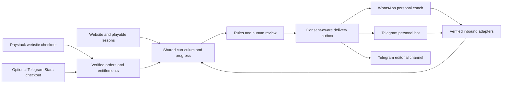

# WhatsApp, Telegram and the community interface

Research date: 27 September 2026. Decision proposal, not a claim of deployed integrations. Read alongside `CLAUDE.md`; this report does not change its no-signals product rule.

## Recommended decision

Use the website as the durable learning and account system, WhatsApp as the personal learning/support interface, and Telegram as the community distribution and discussion interface. Start with one compelling daily chart decision, a short explanation and a link into the relevant playable lesson. Publish annotated historical scenarios and learner-approved breakdowns, not buy/sell calls.

The useful part of the “vegetables versus candy” critique is about packaging: people need an immediate, concrete payoff before they care about curriculum terminology. Test “Would you take this trade?” and “Can you spot the trap?” against “Learn position sizing.” The leap from that observation to “customers demand rent money tomorrow, therefore sell signals” is unsupported and conflicts with this product's stated purpose.

## What is verified

### WhatsApp: interaction rules and commercial implications

WhatsApp requires a recipient-provided number/username and opt-in for subsequent contact; opt-outs must be respected. Business-initiated contact uses approved templates. Free-form replies are permitted during the rolling 24-hour window following a user message. Automated replies need a clear support escalation path. Sensitive account/card identifiers must not be requested in chat. Policies restrict facilitating currencies, ICOs and binary options, and misleading or exploitative services; licenses do not override those prohibitions. Educational content is not thereby an automatic approval for a trading-signal service. Obtain a specific policy assessment before any such business-model change. [WhatsApp Business Messaging Policy, updated 23 September 2026](https://business.whatsapp.com/policy)

Billing is per delivered message, with recipient-market/category pricing. Service replies are free; utility messages responding to users can also be free. The pricing page describes a 72-hour free entry window for qualifying click-to-WhatsApp ads/Page entry points. Nigeria has its own listed market; Ghana's applicable regional rate must be confirmed against the live rate card. Budget daily lessons as potentially marketing templates until their actual category is approved. No numeric cost estimate is justified until category, market, frequency and provider markup are fixed. [Official pricing](https://business.whatsapp.com/products/platform-pricing)

Proposed consent copy: “Send me one practice question on WhatsApp each weekday. I can reply STOP at any time.” Store purpose, timestamp, source, version and revocation. Keep support/receipts separate from optional daily practice. A purchase alone should not silently subscribe someone to every message category.

### WhatsApp: onboarding and implementation

Meta's official Postman workspace supplies the Cloud API and account-management collections. WABA webhook subscription is explicit; subscribing to the account covers its phone numbers. Subscription operations use a system-user token with `whatsapp_business_management`. [Meta official collection](https://www.postman.com/meta/whatsapp-business-platform/overview), [Webhook subscriptions](https://www.postman.com/meta/whatsapp-business-platform/folder/ozgs3jn/webhook-subscriptions)

Meta's archived SDK documentation distinguishes GET verification-token/challenge handling from POST authenticity checks using `x-hub-signature-256` and the app secret. Use it as protocol corroboration, not as a recommendation to install the archived SDK. Reconfirm against current API documentation during implementation. [Meta webhook protocol reference](https://whatsapp.github.io/WhatsApp-Nodejs-SDK/api-reference/webhooks/start/)

Implementation plan: create/select the business portfolio, app, WABA and approved business number; configure production credentials and billing; subscribe message/status webhooks; test signed intake and replies; submit the daily template; record delivery and errors. Own-business onboarding and building an onboarding service for other businesses are different projects; do not accidentally expand this into a Meta Tech Provider platform.

Native WhatsApp payment availability in Ghana/Nigeria was not established from current primary documentation in this pass. Therefore design a clearly labelled secure website checkout using Paystack and return the result to chat. Do not advertise “never leaves WhatsApp.” Never collect MoMo PINs, card numbers or OTPs in the conversation.

### WhatsApp: groups, channels and AI caveats

Do not repeat the obsolete blanket claim that WhatsApp has no Groups API. A current official Groups documentation route exists, but Meta's developer pages returned errors in this research session; exact eligibility and limits were not independently verified from readable primary material. Do not commit a large community rollout to it. [Official Groups documentation, retrieval blocked](https://developers.facebook.com/documentation/business-messaging/whatsapp/groups)

No supported public Channels publishing endpoint was verified here. Treat a human-managed WhatsApp Channel or community as a manual editorial option until an official supported interface is confirmed. Do not substitute browser-session/reverse-engineered automation for the Cloud API.

The repository says a scoped curriculum coach is needed because of January 2026 AI-provider restrictions. The current legal URL redirected to a login page, and enforcement is jurisdiction-sensitive: Brazil's competition authority reports an interim measure suspending the restrictions there. Keep the curricular scope, but do not present the January policy as a universally unchanged rule or imply automatic clearance for an AI coaching business. Obtain the current applicable terms through the business account before launch. [Terms entry point](https://www.whatsapp.com/legal/business-solution-terms), [Brazil CADE primary statement](https://www.gov.br/cade/en/matters/news/cade-upholds-interim-measure-against-whatsapp)

### Telegram: better fit for programmable community distribution

Create the bot via BotFather and connect a backend. Telegram supports group/channel updates, commands and configurable group privacy mode. Default bot messaging is free within throughput limits; ordinary bulk broadcasts are approximately 30 messages/second, group bots 20 messages/minute and individual chats approximately one/second. Queue deliveries rather than promising simultaneous delivery at scale. [Official Bot FAQ](https://core.telegram.org/bots/faq)

Use an editorial channel with a bot granted only required posting rights, a linked moderated discussion group, and an optional personal bot. For the pilot, keep community submissions in the website's review queue and post only approved artifacts. This provides a consistent canonical record, moderation and attribution across channels.

Telegram webhooks accept a configured secret which arrives in `X-Telegram-Bot-Api-Secret-Token`; delivery retries make idempotency essential. Use `update_id` deduplication and an outbox with bounded retries. The Bot API includes channel posting, inline keyboards, polls and sharing/forwarding methods. [Bot API](https://core.telegram.org/bots/api)

Mini Apps can reuse web UI inside Telegram, but incoming identity data must be validated server-side. Do not trust `initDataUnsafe`; validate `initData` and freshness. Handle Telegram theme, safe areas and viewport changes. A Mini App is optional after the ordinary bot and mobile website prove useful. [Mini Apps documentation](https://core.telegram.org/bots/webapps)

### Telegram: a separate payment constraint

Digital goods/services sold inside Telegram bots or Mini Apps must use Telegram Stars (`XTR`), even when the business also sells through its own website. A learning pass/cohort access sold there is a digital purchase; embedding a Paystack checkout is not a justified workaround. Telegram documents invoices, `pre_checkout_query`, `successful_payment`, storing charge IDs, refunds and `/paysupport`. Entitlements must follow successful payment, not pre-checkout approval. [Official digital payments rules](https://core.telegram.org/bots/payments-stars)

Recommended first version: free Telegram distribution and support; independent website purchases through Paystack. Before presenting purchase links or monetized access inside Telegram, settle the compliant access pattern or add a Stars adapter. Keep one order/entitlement model with separate Paystack and Stars providers. Do not hard-code a universal cash value for Stars or assume its payout economics match Paystack.

## Correcting the inflation premise

The current official Ghana Statistical Service homepage reports **5.0% year-on-year CPI inflation for August 2026**. [GSS](https://www.statsghana.gov.gh/)

Nigeria's official NBS homepage reports **15.39% headline CPI inflation**; its official catalogue lists an August 2026 CPI report released 15 September 2026. The homepage alone does not label that figure's month in the extracted text, so cite the catalogue alongside it. The downloadable ZIP report was not parsed in this pass. [NBS](https://www.nigerianstat.gov.ng/), [NBS report catalogue](https://microdata.nigerianstat.gov.ng/index.php/catalog/154/related-materials)

These observations do not support “Ghana and Nigeria are both drowning in 30%+ inflation” as a current numeric claim. Lower inflation does not mean household costs have returned to previous levels. Financial pressure is plausible; the assumption that it proves demand for signals or willingness to pay particular prices still requires interviews and observed conversion.

## Proposed shared architecture and release gates

The orchestration should retain the project rule “AI explains; code calculates.” A channel router selects curriculum actions; deterministic engines produce outcomes; Jev may propose process scores; human moderation handles publication/escalation. Channel APIs must not become autonomous trading or money-moving agents.

Minimum gates before a live pilot:

1. Signature/secret validation, duplicate webhook handling, account linking and per-user authorization.
2. Consent and STOP flow, 24-hour/template routing, quiet hours, delivery budgets and suppression after permanent failure.
3. One authored practice loop that returns the same result across web and chat; no fabricated price/news inputs.
4. Checkout success, failure, delayed confirmation, retry and duplicate-event tests before granting paid access.
5. Human review queue for Floor submissions and clear explanation that scores assess the submitted process, not future profitability.
6. Pilot measures: activated learners, completed first practice, D7 return, opted-in daily completion, delivery cost per active learner, unsubscribe/block rate and paid renewal. Membership counts alone are insufficient.

This report makes no account-configuration, native-payment-availability or end-to-end delivery claim. No external account or message was created.
