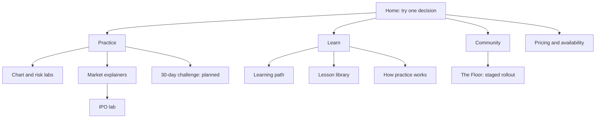
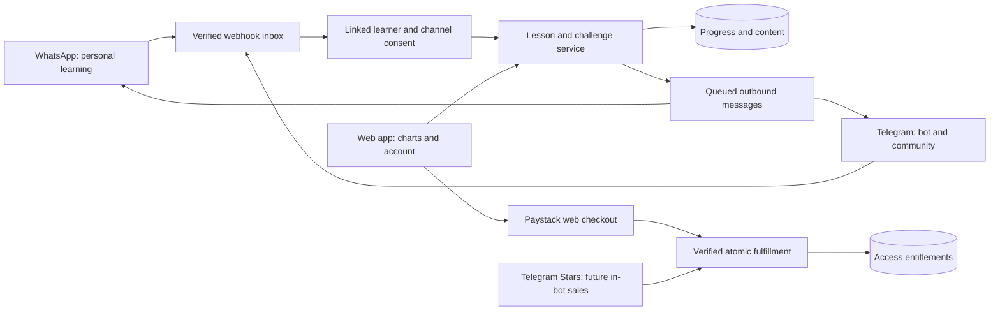

# Product, brand and rollout decision brief

Date: 27 September 2026. Status: recommendation for founder discussion, not an approved rebrand or a claim of production readiness.

The user requested research, a multi-agent audit, naming/logo exploration, all-page UX review, channel strategy and a decision to weigh before next steps. This pass preserves existing app edits and produces review artifacts; it does not launch payments, send messages, deploy, or change the brand.

Companion reports: [implementation audit](2026-09-27-implementation-audit.md), [page-by-page audit](2026-09-27-page-audit.md), [channel research](2026-09-27-channels.md), [responsive route evidence](2026-09-27-responsive-results.json).

Verified in this pass: 127 core checks, TypeScript and lint passed. Browser checks found no document-level horizontal overflow across 20 route samples at 360/375/390px and 18 routes at 768/1024/1440px; all 54 tablet/desktop visits returned 200. This is layout/route coverage, not all interactive states or live integrations. The audit found illegible/corrupted text in the existing generated IPO diagram: replace it with an authored responsive diagram. Production payments, messaging delivery and account/database configuration remain unverified.

## Recommended decision

Build a trading practice club with a useful daily challenge. Keep the deterministic simulation engine and short lessons. Lead with a concrete decision and its consequences, then explain the lesson. Use WhatsApp for personal re-engagement and Telegram for community distribution. Keep the web app as the canonical place for identity, simulation, progress and entitlements.

Target the curious beginner and the trader who wants to understand mistakes, rather than promising an answer to an urgent income need. This is a positioning hypothesis to test with people, not evidence that an entire region prefers signals.

Do not pivot to a paid buy/sell signal service in this release. Live asset entry/stop/target messages may function as recommendations regardless of an educational disclaimer. Nigeria SEC explicitly addresses unregistered investment/advisory promotions on WhatsApp and Telegram; Ghana requires registration/licensing when an online platform performs licensed activities. The exact proposed service requires jurisdiction-specific assessment before introducing actionable signals.

Sources: [Nigeria SEC notice](https://sec.gov.ng/for-investors/keep-track-of-circulars/public-notice-unregistered-online-investment-schemes/), [Ghana SEC directive](https://sec.gov.gh/directive-to-market-operators-fintech-service-providers-and-persons-owning-and-or-operating-online-investment-and-trading-platforms/).

## Naming research and logo direction

| Candidate | Assessment | Decision |
| --- | --- | --- |
| Chartward | Signals charts and forward learning; short enough for a wordmark; less suited if the product becomes general household finance | Lead candidate for user testing |
| Sika Lab | Ghanaian origin and continuity; meaning needs explaining outside Ghana; Sika is crowded in finance | Keep as the control in testing |
| Market Reps | Clearly suggests repeated practice after explanation; can also mean sales representatives | Useful feature/campaign name, weaker master brand |
| Trade Rehearsal | Immediately describes the value; long and descriptive | Strong descriptor, weak distinctive brand |
| Candlecraft | Relevant metaphor but direct adjacent naming collisions | Reject |

Searches on 27 September covered exact and finance/trading variants of Chartward, Sika Lab/Labs, MarketReps, TradeRehearsal and Candlecraft. No obvious relevant Chartward brand surfaced in the returned results. This does not establish domain, handle, company-name or trademark availability. No registrations were purchased or checked through a trademark registry. Before adoption: check relevant national and international registries, domain/handles, pronunciation/recall with Ghanaian and Nigerian users, and confusingly similar names.

Observed first-party collisions: [Sika Pay](https://sika-pay.com/), [SikaDaily](https://sikadaily.com/), [CBG Sika Agent](https://www.cbg.com.gh/news/cbg-introduces-sika-agent-to-boost-financial-inclusion-across-ghana). Candlecraft overlaps [SuprAlgo's CandleCraft products](https://www.supralgo.com/) and [Candle Craft Academy](https://candlecraftacademy.com.np/). These are naming observations, not endorsements of those products.

Logo concept: `brand-concepts/chartward-direction-01.png`. Clean wordmark, open C/bracket symbol and a decision-point square, charcoal/ivory with an amber accent. Tagline: **Read the market. Rehearse the decision.** Treat the image as an exploration board, not a final vector logo. Production work should redraw the selected mark in SVG, optically test 16/24/32px, test monochrome, and deliver horizontal/stacked/favicon variants. Avoid profit arrows, currency symbols and complex candlestick illustrations.

The logo was generated using the built-in image-generation tool. Exact generation prompt is in `brand-concepts/prompt.md`. No existing product logo was replaced.

## The vegetable-versus-candy argument

The useful insight is that people need an immediate, emotionally engaging reason to start. The unsupported leap is that everyone in Ghana and Nigeria wants speculative instructions instead of learning. Inflation does not prove willingness to pay, acquisition cost, retention or demand for this product. Use current country-specific figures rather than the pasted blanket 30%+ claim; see the channel research for the official-source check.

Replace abstract lecture titles at the entry point with concrete scenarios:

| Teaching concept | Entry hook | Actual learning outcome |
| --- | --- | --- |
| Position sizing | “The same chart. Two trade sizes. Which account survives?” | Calculate exposure and compare losses |
| Expectancy | “Can a trader lose more often and still finish ahead?” | Understand win rate versus payoff |
| Leverage | “What does a 2% move do to this account?” | See amplified gains and losses |
| Trade planning | “Would you take this trade—or skip it?” | State a thesis, invalidation and size |
| IPO valuation | “A small share price does not mean a cheap company.” | Relate price, share count and valuation |

The shareable object should be a decision card with the scenario identifier, simulation/historical label, user's reasoning, and a link to replay the same challenge. Never invent simulated profits as customer results. For sealed historical replays, hide the future until a plan is locked. Staff-reviewed breakdowns are the first community format; member publishing follows moderation tooling.

## Information architecture

Recommended primary navigation: **Practice · Learn · Community · Pricing**. Sign-in and the primary “Try a challenge” action sit separately. Method belongs under Learn; the IPO explainer belongs within Practice / Market explainers. Keep existing route URLs initially to avoid unnecessary migration. Community stays clearly marked as a preview until publishing and moderation exist. Add a challenge destination only once it is implemented.

## Landing page proposal

1. Short navigation and a factual topic banner only when useful. The IPO remains a topic, not the site's identity.
2. Hero headline: **Would you take this trade?** Supporting copy: “Read the chart, make a plan, and see what happens in a simulation. Build your trading skills one decision at a time.” Primary action: **Try a free challenge**. Secondary: **Explore the learning path**. Show “Simulated money · Start without an account” only while the guest path remains true.
3. Put the playable decision beside the hero on desktop and directly below the short introduction on mobile. A real chart interaction is better proof than a generated terminal screenshot.
4. Reveal the outcome and explain the decision. Make it possible to continue, replay, or save progress. Introduce account creation after demonstrated value, with an honest explanation of device-only versus synced progress.
5. Three entry cards: new to charts; making trades but repeating mistakes; understanding a market event. Route each to existing content rather than asking for an elaborate onboarding interview first.
6. Show the learning path using verified live counts and a separate planned label. Invite a short next lesson rather than presenting all 52 as available.
7. Community preview: an explicitly illustrative locked plan, with the reasoning and review process. No invented members, verified-mentor claims, or scores presented as operational.
8. Offer a real opt-in for reminders, with channel choice, frequency and unsubscribe. Pricing describes exactly what exists now and what a future pass would unlock.

Copy on each page should distinguish free now, account needed, paid when available, and planned. Use positive capability language before policy explanations. Keep concrete risk boundaries near relevant actions rather than repeating “no” throughout every headline.

### Motion and responsive acceptance criteria

Preserve the existing Three.js/CSS foundation and improve its purpose before adding libraries. Candidate motion: chart outcome transitions after input, a one-time plan-lock transition, small page transitions and optional subtle hero depth. No looping price spectacle, scroll hijacking, hover-only actions, or blocking intro animations. The useful content must render without animation.

Required QA for the implementation: 320, 360, 375, 390, 430, 768, 1024, 1280, 1440 and 1920px; portrait/landscape where appropriate; touch and keyboard; 200% zoom; menu focus/escape/return; reduced motion and Save-Data. Use a capped content width on large monitors. Verify chart labels, sticky navigation, bottom safe areas, dialogs and all error states. Check real performance before setting claims: proposed field targets are LCP <=2.5s, INP <=200ms and CLS <=0.1 at p75; these are targets, not measured results.

## Channel architecture

WhatsApp should support resume, short decisions, authored explanations, reminders and support. Rich charts open the web app. Telegram should host editorial challenge broadcasts, discussion and deep links; a bot can link identities and send requested reminders. Do not equate WhatsApp Cloud API with unrestricted group/channel broadcasting. Verify current eligibility and API support before promising automated groups/channels. See the separate sourced channel report for cost, policy and setup details.

Store separate channel identities and consent (source, timestamp, purposes, frequency, revocation), deduplicate provider events, authenticate webhooks, enqueue slow work, track delivery/failure, and provide STOP/mute controls. Never match an account solely by an unverified phone number. Use expiring one-use account linking. Do not expose journal data to group chats.

## Implementation order and exit conditions

### 0. Repair the foundation

Fix completion trust and account/device event ownership; separate telemetry from verified learning evidence. Add event idempotency, typed schemas and appropriate abuse limits. Validate lesson IDs, question IDs, attempts and answers server-side. Keep unauthenticated local practice possible but do not let a local event award trusted credentials. Prove cross-device write/read behavior and guest-to-account linking.

Fix observable UX claims: missing chart-lab anchor, playable count, contactless waitlist success and failure states. Update stale docs and deployment claims only after verification.

### 1. Landing and page polish

Implement the reviewed hierarchy and first decision loop, then work through every page in the companion audit. Add a real contactable, consented interest flow. Run functional and responsive checks, not just overflow detection. Build reusable components for buttons, status labels, diagrams and motion.

### 2. Messaging pilot

Start with a free Telegram editorial channel and a WhatsApp learning flow for consenting participants. Prepare webhook adapters and provider-independent outbox/account linking before credentials arrive. Verify a real inbound/reply/opt-out/delivery-status cycle. No unsolicited sends or fabricated bot URLs.

### 3. Stage 7 and the Floor pilot

Stage 7 needs a durable challenge lifecycle, locked plan, seeded replay/fills, rule-versioned loss limits, explicit trading-day/calendar-day handling, trade journal and final evidence report. Break p1-p5 into playable authored steps backed by these capabilities. A 30-day claim requires elapsed-time rules; do not simulate thirty days in one click and call it thirty days of adherence.

Build the Floor in phases: staff-reviewed posts and reactions; then member drafts with moderation; then reputation. Compute objective plan adherence from recorded simulation actions. Use Jev for qualitative flags/assessments with uncertainty and human review, not as the source of money calculations or unquestionable public reputation. A pasted screenshot cannot prove external MT5 execution or stop adherence.

### 4. Paid web pass

Start with one clearly defined one-time pass only after its paid benefit is usable. Merchant ownership, account country, price, currency, refund policy and tax treatment are founder choices still required. Do not treat strategy document price ranges as approved offers. Ghana MoMo availability does not imply the same rails for Nigeria.

Server-owned catalog -> pending order/reference -> Paystack initialization -> provider checkout -> verification -> atomic paid transition and entitlement. Verify raw-body HMAC SHA-512 webhooks, reference, amount, currency, mode, provider/status and order mapping. Exercise duplicate/delayed webhook, callback race, abandonment, failure, refund and reconciliation. Use hosted checkout first unless a demonstrated conversion need justifies direct charge UX. Paystack restricts its direct Card API to PCI-compliant businesses; use its supported checkout for cards, not our own card-detail fields. Keep provider-specific transactions separate from entitlements so Telegram Stars can be added without duplicating access logic. [Paystack payment channels](https://paystack.com/docs/payments/payment-channels/).

### 5. Evidence before expansion

Run a small invited pilot, then make a consumer-vs-B2B investment decision. Education incumbents and paper-trading tools already exist: [BabyPips](https://www.babypips.com/learn/forex), [TradingView paper trading](https://www.tradingview.com/support/solutions/43000516466-paper-trading-main-functionality/). The differentiation to test is short guided decisions, consequence replay and consistent practice delivered through familiar channels—not a claim that no competitor exists.

Keep broker/prop-firm partnerships exploratory. No evidence currently supports the pasted annual contract sizes, acquisition bounties, cashflow rankings or exit recommendation. Prop evaluation rules also vary; do not advertise one generic 5%/10% simulator as universally matching firms. [FTMO objectives](https://ftmo.com/en/trading-objectives/) are an example to inspect for a specific program, not a universal standard.

## Growth experiment

Proposed north star: weekly learners completing at least three verified decisions with a recorded rationale. Count people and useful learning, not bot messages or manufactured signups.

Instrument: source/campaign -> challenge start -> first decision -> outcome viewed -> account/save -> reminder opt-in -> return -> next completed decision -> checkout -> verified paid entitlement. Track activation, D1/D7 return by cohort, Stage 1-to-3 progression, share-to-activated-learner conversion, opt-out/block rate, verified pass conversion, refunds and contribution margin.

Exclude QA/bot/duplicate events and state the denominator. Compare an action-led landing against the present education-led copy. Choose primary metric and test window before launch, report counts with uncertainty, and do not infer success from a few clicks. Pilot size 50–100 is a proposed operational cohort, not a statistically powered conversion experiment. Paid thresholds should be set from measured channel/support costs; there is no defensible universal target yet.

Suggested interviews: what brought you here; where do you currently learn; what did you do after a wrong trade; which challenge made sense without help; would you return without signals; what would you actually pay for; which channel and frequency do you want? Test willingness to pay with an explicit offer, not a fake successful checkout.

## Decisions for the founder conversation

1. Chartward as the naming direction, or retain Sika Lab while testing the proposition?
2. Practice-led club with shareable educational setups, or a separately scoped regulated signal/advisory business?
3. First paid benefit: a guided challenge with reviews, a cohort, or another clearly deliverable service?

Recommended bundle: test Chartward, build the practice-led club, use WhatsApp plus free Telegram community, repair progress trust before Stage 7, then sell a single web pass for a working guided challenge. Account setup and final commercial terms follow that choice; no live charge or message has been initiated in this research pass.
