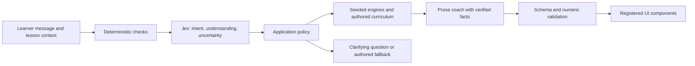

# Chartward: monetization and conversational-product research

Research date: 27 September 2026. Prices below distinguish observed competitor offers from proposed experiments. This report does not announce a paid launch or claim demand has been established.

## Decision

Sell **structured practice and useful feedback**, not information access alone. The initial promise should be concrete: “Build a trading plan, practise it without real money, and understand the mistakes you repeat.” A short chart decision makes that promise tangible before a visitor sees curriculum terminology.

Launch one time-limited paid learning pilot, with a generous free baseline. Avoid simultaneously selling a subscription, certification, signals, mentor marketplace and enterprise SDK. The present commercial unknown is whether learners repeatedly value Chartward's feedback enough to pay, not whether another pricing tier can be invented.

## What customers can already obtain

| Product | Primary-source offer observed | Why it matters to Chartward |
| --- | --- | --- |
| Babypips Premium | New-subscriber pricing announced from 8 April 2026: $29/month or $205/year; expanded Pipsology lessons, MarketMilk, analysis and an ad-free experience. [Official price change](https://premium.babypips.com/lock-in) | The old $9.99 anchor is stale for new subscribers. Content can be paid, but Chartward cannot infer local willingness to pay from a global incumbent. |
| Brilliant | Official U.S. comparison lists $30 monthly/$240 annually; free tier has two daily lessons and limited tutor access, Premium removes limits and provides full Koji access. Price depends on location/platform. [Official comparison](https://brilliant.org/resources/choosing-brilliant/is-brilliant-worth-it/), [current subscription page](https://brilliant.org/subscribe/) | The paid bundle is pace, flexibility, personalized practice and tutoring. “AI exists” alone is not the value proposition. |
| TradeZella | Essential $35/month or $315/year; Pro $59/$531; Ultra $99/$891. Paid features combine journaling, replay, reports, account connections and capped AI credits. [Official July 2026 update](https://help.tradezella.com/en/articles/8911582-our-pricing), [plans](https://www.tradezella.com/pricing) | Traders already buy workflow improvement, not just lessons. A useful mistake review and progress report can be more valuable than more explanatory text. |
| TradingView | Basic through Ultimate tiers; paid capacity includes more charts, history, alerts and replay. The fetched official page exposed feature limits but not numeric prices, so none are quoted here. [Official plans](https://www.tradingview.com/pricing/) | Charts and replay alone are insufficient differentiation. Avoid building a reduced TradingView with education copy attached. |
| FTMO | Free Academy plus free evaluation trials. Official 1-Step offer currently displays €79 for the $10,000 simulated-account tier. Challenge fees are one-time. [Academy](https://academy.ftmo.com/), [trial](https://ftmo.com/faq/how-about-a-free-trial/), [1-Step offer](https://promo.ftmo.com/new-1-step-challenge/), [fee FAQ](https://ftmo.com/faq/are-the-fees-recurrent/) | A paid “mock challenge” competes with a free direct-provider trial. Chartward must offer independent diagnosis, explanations and accountability rather than imply passing its simulation grants funding. |

These are substitutes and useful reference points, not evidence of competitor profitability or Chartward's addressable demand. No competitor conversion, retention, CAC or affiliate payout is assumed. The pasted assessment's confident acquisition/enterprise price ranges and “highest cashflow” statements remain hypotheses.

## Exact free and paid pilot hypotheses

### Free baseline

- One complete first-session chart scenario with explanation, usable before sign-up.
- Foundation/risk lessons, deterministic position-sizing practice, a basic journal and saved progress with an account.
- A weekly practice scenario and community editorial digest.
- A small, plainly disclosed coach allowance; authored explanations remain usable when AI is unavailable.
- Learners retain access to their own completed-session records after paid access expires.

This is a recommendation for the next packaging iteration, not a direction to remove existing free access without reviewing current promises.

### Pilot A: 30-day Practice Pass

**Initial test price: GH₵60 or ₦5,000 for 30 days, paid once.** These are local-market hypotheses, not exchange-rate equivalents or approved public prices. Test GH₵40/90 or ₦3,000/8,000 in later, clearly described cohorts after the first useful cohort; do not fragment a tiny sample into six pricing cells.

Exact proposed deliverables:

1. Twenty weekday practice scenarios with pre-decision plan capture, reveal and explanation.
2. A personal mistake queue and four weekly progress summaries built from observed actions.
3. Up to 100 contextual coach follow-up turns over the pass; display remaining usage honestly. Deterministic calculators and authored explanations remain available beyond the AI allowance.
4. End-of-pass evidence: completed scenarios, recurring errors, rule adherence and a suggested next practice sequence. Call it a practice report, not a professional qualification or predictor of returns.

The daily challenge and report must actually be deliverable before taking payment. Human-curated scenarios and manually reviewed weekly reports are acceptable in a clearly labelled founding pilot; silently selling planned software is not.

### Pilot B, only after A: four-week guided clinic

**Hypothesis: GH₵180 or ₦15,000 for four weeks**, maximum twenty learners per cohort because the instructor's time is bounded. Includes the pass, four scheduled 60-minute group replay clinics and one 15-minute individual plan review. Publish dates, instructor, scope and rescheduling/refund terms before charging. Never call this “unlimited mentorship.”

At twenty seats, one round of individual reviews takes five hours; four clinics add four hours, and an assumed four hours of preparation/moderation makes thirteen hours before administration. Price the named instructor's actual cost before accepting this offer. A 60/40 revenue share is not automatically commercially sensible.

### Institution hypothesis, discovery in parallel

Offer a small co-branded learning pilot, not an enterprise SDK immediately: one existing roadmap, one cohort, onboarding, a completion report and a debrief. Interview budget owners at two universities/investment clubs, two employers and two licensed financial businesses. Determine who buys, which outcome they fund, procurement lead time, accessibility/data requirements and whether there is an actual budget. An expression of interest is not a contract. Do not state B2B is “the fastest revenue” without a paying design partner.

Defer paid certificates until recognition has an identifiable buyer. Defer broker/prop-firm commissions until trust, disclosure and economic conflicts are assessed; do not optimize revenue around deposits, trade frequency or repeated challenge purchases.

## West African collection and channel economics

Paystack's Ghana pricing page lists **1.95%** local/international collection fees. Nigeria's standard local rate is **1.5% + ₦100**, with the flat fee waived below ₦2,500 and total local fee capped at ₦2,000. A merchant's enabled countries/currencies and account approval still need confirmation. No cross-border acceptance is inferred from these published rates. [Ghana pricing](https://paystack.com/gh/pricing), [Nigeria pricing](https://paystack.com/pricing)

Paystack subscriptions support cards and Nigerian direct debit; MoMo is not recurring. Ghana MoMo requires customer authorization on their phone and asynchronous final confirmation. Therefore begin with an explicit renewable 30-day pass. Do not describe every card payment as incapable of automatic renewal, or advertise auto-renewing MoMo. [Subscriptions](https://paystack.com/docs/payments/subscriptions/), [MoMo](https://support.paystack.com/en/articles/2128386), [payment channels](https://paystack.com/docs/payments/payment-channels/)

WhatsApp message spend depends on delivered category and recipient market; daily practice templates cannot be assumed free. Telegram digital purchases inside bots/Mini Apps use Stars. The first channel report contains the policy details. [WhatsApp pricing](https://business.whatsapp.com/products/platform-pricing), [Telegram Stars](https://core.telegram.org/bots/payments-stars), [channel report](./2026-09-27-channels.md)

Operationally, let learners choose reminders rather than paying to send every lesson to every account. An opted-in message can bring them into an interactive session. Store consent and measure learning completions per paid message. Telegram's free editorial channel can distribute the same reviewed scenario without replacing the website's saved progress.

## Unit economics: a model, not a forecast

All costs below except published gateway formulas are **assumed per paid 30-day learner**, deliberately visible so real measurements can replace them. No exchange rate is assumed. Tax, founder salary, product development, fixed hosting, acquisition, chargeback penalties and content licensing are excluded, so the result is contribution before those costs, not profit.

| Item | Ghana base case | Nigeria base case |
| --- | ---: | ---: |
| Pass price | GH₵60.00 | ₦5,000 |
| Collection fee, published formula | GH₵1.17 | ₦175 |
| Refund reserve, assumed 5% of sales | GH₵3.00 | ₦250 |
| AI budget, assumed | GH₵3.00 | ₦250 |
| Messaging budget, assumed | GH₵4.00 | ₦350 |
| Variable support, assumed | GH₵8.00 | ₦500 |
| Contribution before excluded costs | **GH₵40.83** | **₦3,475** |
| Contribution margin | **68.05%** | **69.50%** |

Formula: `contribution = collected price - gateway fee - refund reserve - AI cost - messaging cost - variable support`.

With the same cost allowances, Ghana's GH₵40 price produces GH₵22.22 contribution (55.55%); GH₵90 produces GH₵68.745 (76.38%). Nigeria's ₦3,000 produces ₦1,605 (53.5%); ₦8,000 produces ₦6,280 (78.5%). Round actual ledger amounts in minor units according to the provider's rules, not these planning decimals.

Stress case: double AI, messaging and support, and reserve 10% for refunds. Ghana contribution falls to GH₵22.83 (38.05%); Nigeria to ₦2,125 (42.5%). Cheap subscriptions cannot subsidize unbounded human chat. Meter support time and token/message spend per account before scaling acquisition.

For AI, record provider `usage.cost`, model/version, calls and retries. Derive an observed per-active-learner cost from actual sessions; the allowances above are not provider quotes. For messaging, calculate `delivered billable messages × applicable rate + provider markup`, split by market/category. For taxes and exchange conversion of USD AI costs, replace allowances with accountant-approved treatment and actual settlement rates.

Revenue illustration only: 100 payers at the base price collect GH₵6,000 or ₦500,000 per pass period. If a fully explicit example has 1,000 activated learners and 5% paying, only fifty pay: GH₵3,000 or ₦250,000. Neither activation count nor conversion is forecast. Do not value users as subscribers or project annual revenue by assuming every first purchase renews.

## Validation sequence and decision gates

1. **Fifteen problem interviews:** five complete beginners, five self-directed learners with demo experience, five people who have previously paid for courses/tools/challenges. Ask about the last concrete attempt, actual spend, abandoned tools, time constraints, and how they decide a practice session helped. Do not solicit account passwords or brokerage access.
2. **Observed value before pricing:** each completes one Chartward scenario and explains what changed in their next decision. Ask what they would use instead and what was confusing. Record behavior and quotes with consent.
3. **Twenty-person paid founding pilot:** show exact deliverables and price, then accept real payment only after checkout/entitlements and delivery are ready. Track offered → bought → activated → returned → completed → renewed. Record reasons for refusal; friends agreeing enthusiastically are not equivalent to independent buyers.
4. **Predeclared pilot gates, chosen targets rather than market facts:** at least 80% start within 48 hours; at least 50% return in week two; median completion at least 10 of 20 scenarios; at least 30% buy a second pass without a discount; contribution margin at least 60% using actual variable costs. Report counts alongside percentages because twenty users is a small sample.
5. **Learning quality:** pre/post unseen scenarios scored by a fixed rubric, with a human checking a sample blind to timepoint. Improvement in observed process is the intended outcome; simulated profits and enjoyment are separate metrics. Missing follow-up learners count as missing, not as improved.
6. **Decision:** if activation fails, fix first-session UX; if return fails, fix recurring value; if learning improves but payment fails, test buyer/format/pricing; if support cost fails, narrow deliverables. Only scale acquisition after two cohorts give consistent evidence. Avoid CAC/LTV claims before renewal data exists.

## Jev and the conversational product

The current OpenRouter API reference uses `POST https://openrouter.ai/api/alpha/decisions` with `typesafe/jev-1.13`. Requests contain state and keyed typed questions; responses contain keyed answers and usage. This matches the endpoint/model currently in `lib/decisions/jev.ts`. [Official API reference](https://openrouter.ai/docs/api/api-reference/alphadecisions/submit-a-decisions-request)

Jev is a decision model, not the prose coach. `choice` gives a distribution over authored options; its confidence is not simply the winning probability. `noul` gives yes-probability. `score` gives a probability-weighted value on an ordered zero-based rubric. Batch independent questions, validate returned fields, and do not substitute plausible defaults when required answers are missing. Calibration should use labelled local examples, not treat a generic threshold as proof of accuracy. [Official tutorial, 23 September](https://openrouter.ai/blog/tutorials/how-to-use-jev/)

Recommended product separation:

Useful narrow Jev judgments: which known concept the learner is struggling with; whether their written rationale mentions the required invalidation; whether more explanation is needed; whether a submission needs human review. Keep arithmetic, eligibility, money, completion counts and permission checks in code. A process score must be tied to a published rubric and retained evidence, not a generic “AI says 87/100.”

Before claiming live conversational verification, test actual context persistence, multi-turn clarification, wrong/ambiguous answers, missing provider credits, timeout, invalid model output, numeric hallucination attempts, prompt injection and reduced-network fallback. Provider success in a standalone probe does not establish that the browser route and learner state work end to end.

## Which OpenUI?

“OpenUI” is ambiguous. The likely generative-interface reference is **Thesys OpenUI**: it defines permitted components and typed props, generates prompt instructions, and renders a structured streaming language. The project publishes React packages and a registry-oriented approach. [Official repository](https://github.com/thesysdev/openui)

It is different from **W3C Open UI**, a community effort around extensible native web controls, and **Weights & Biases OpenUI**, a describe-and-render UI-generation project. [W3C Open UI](https://open-ui.org/), [W&B repository](https://github.com/wandb/openui)

Recommendation: keep Chartward's existing typed Compose/registered-widget architecture for the pilot. Consider a small Thesys adapter only if current UI composition demonstrably blocks needed contextual practice. Expose only approved widgets and engine result identifiers; resolve values on the server. Generated component props cannot become authority for prices, orders, progress or trading outcomes. Benchmark one lesson for payload, latency, mobile bundle size, keyboard accessibility, malformed output and fallback before adopting a new dependency. No OpenUI dependency was added during this research.

## Immediate corrections to older strategy assumptions

- Update stale competitor price anchors; preserve uncertainty for prices that were not retrievable.
- Replace “only six lessons are playable” with the current audited inventory; the older strategy document is a dated snapshot.
- Remove unsupported “nobody in West Africa does this,” enterprise-contract-value and guaranteed-affiliate-income claims.
- Separate MoMo manual renewal from supported card/direct-debit subscriptions.
- Replace the blanket 30%+ inflation premise with current cited country-specific data from the channel report.
- Treat free alternatives, human-review cost and renewal friction as real design inputs, not reasons to pivot automatically into signals.

No buyer interviews, live purchases, account configurations or provider calls were performed for this report. Revenue and cost examples are arithmetic scenarios only.
